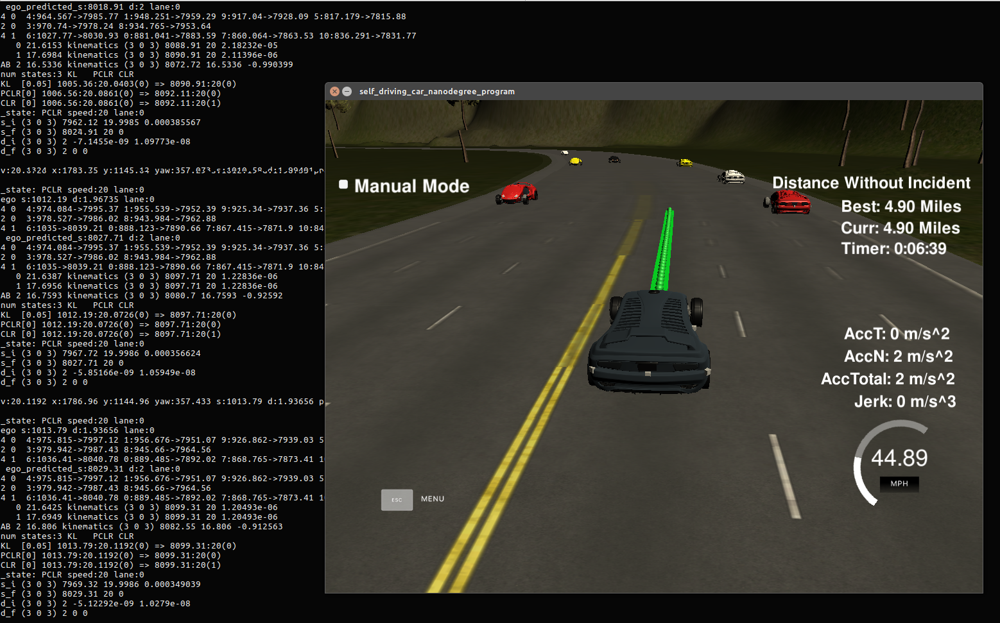
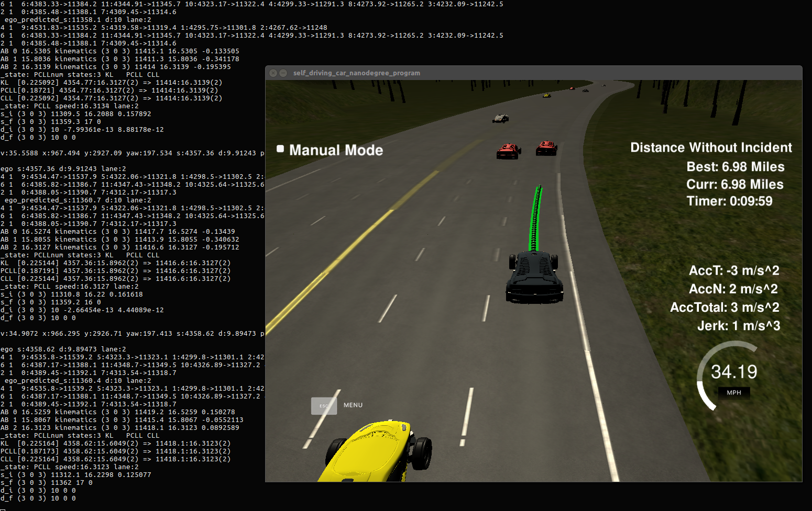
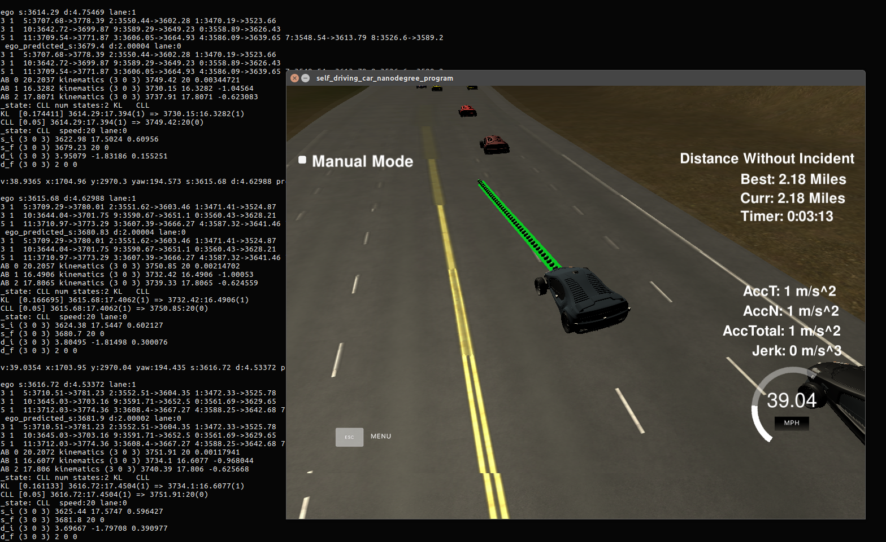
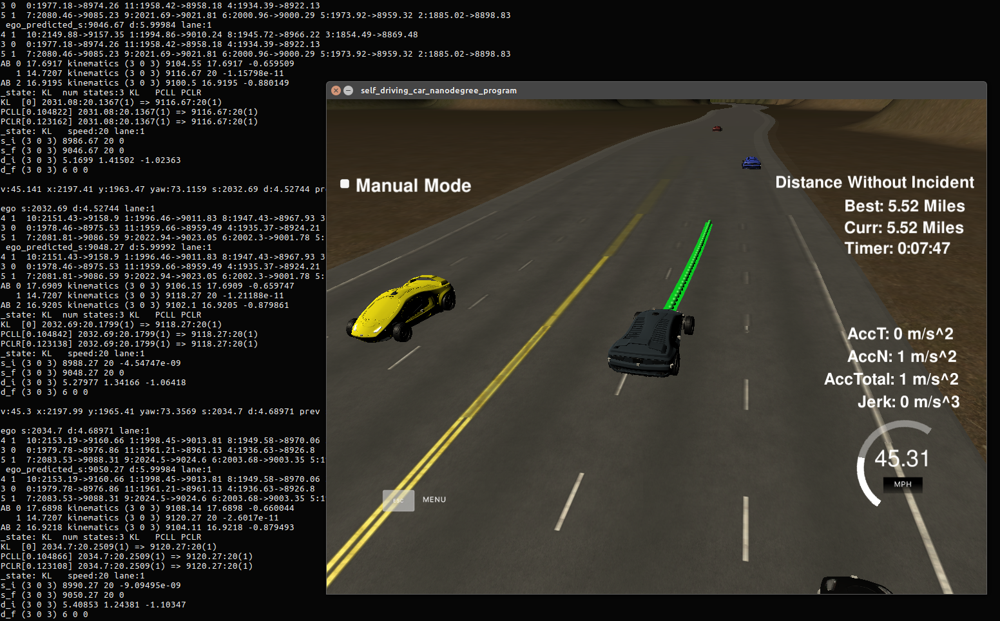

# CarND-Path-Planning-Project
Self-Driving Car Engineer Nanodegree Program

### Design

The top level design can be followed by the following snippet in main.cpp 

            // SETUP TRACK
            track->setLocality(car_s);

            // MOTION & TELEMETRY
            motion->telemetry(track, car_x, car_y, car_s, car_d, deg2rad(car_yaw), car_speed * 0.44704, previous_path_x, previous_path_y, end_path_s, end_path_d);

            vector<double> s_i = motion->getInitS();
            vector<double> d_i = motion->getInitD();

            // PREDICTION
            double prediction_horizon_ego = motion->getPreviousPathTravelTime() + trajectory->time_horizon;
            double prediction_horizon_env = motion->getPreviousPathOverlapTime() + trajectory->time_horizon;

            const Car ego = prediction->predict(track, prediction_horizon_env, motion->getS(), motion->getD(), trajectory, prediction_horizon_ego);
            map<int, const Car> cars = prediction->predict(track, prediction_horizon_env, ego, sensor_fusion); 
           
            // BEHAVIOR PLANNING
            struct Behavior::target target_behavior = behavior->generateBehavior(ego, cars, track, prediction_horizon_env);

            // TRAJECTORY GENERATION
            trajectory->generateTrajectory(s_i, d_i, target_behavior, track, cars);

            // MOTION GENERATION
            motion->generateMotion(trajectory, track);

#### Track

- In order to get more accurate track data, splines are fitted to smaller portion of the track around the cars position.

*input from:* simulator, map data
*outputs to:* Prediction, Behavior, Trajectory, Motion
*files:* track.cpp track.h

	/* Set local fine waypoints and fit splines to be used by more accurate co-ordinate transformation functions */
	void Track::setLocality(int next_wp)
	

#### Telemetry

- I use s and d path points used to generate the x & y points in the last iteration to construct the previous path in terms of s & d (simulator only provide this in terms of x &y)
- first & second order derivative of s & d are calculated using the previous path points created as above

*input from:* simulator, Track
*outputs to:* Prediction, Behavior, Motion
*files:* motion.cpp motion.h

	/* Use previously generated s and d path points to constrcute previus path in terms of s & d */
    for (int i = N_POINTS_MOTION - _previous_path_x.size(); i < N_POINTS_MOTION; ++i) {
      _previous_path_s.push_back(_next_s_vals[i]);
      _previous_path_d.push_back(_next_d_vals[i]);
    }

#### Prediction

- The location of other cars on track are predicted assuming constant velocity
- The location of the ego vehicle is predicted using the trajectory used in the previous iteration

*input from:* Track, Motion, Trajectory
*outputs to:* Prediction, Behavior, Motion
*files:* prediction.cpp prediction.h

	    vector<double> dxdy = track->getDxDy(s, true, true);
        vector<double> sxsy = track->getSxSy(s, true);

        double s_dot = vx*sxsy[0] + vy*sxsy[1];
        double d_dot = vx*dxdy[0] + vy*dxdy[1];

        double s_prediction = s + s_dot * duration;
        double d_prediction = d + d_dot * duration;

#### Behavior Planning

- Traffic is sorted in to lanes in order to detect cars ahead and behind the ego vehicle
- Optimal locations and speeds for each lane is calculated based on lane traffic and ego vehicle position
- A finite state machine is used with 5 states
	- Keep Lane
	- Prepare to Change Lane Left/Right
	- Change Lane Left/Right
- A coarse trajectory is caclulated for each available state and a cost function is used to select the best state. The cost functin is a weighted combination of the following 
	- efficiency cost to penalise slow speed and favour changing to faster lanes
	- outer lane cost to penalising extreme lanes to favour staying in the middle lane
- Behavior module also detects the lead car and passes this information to Trajectory planner

*input from:* Track, Motion, Track, Prediction
*outputs to:* Trajectory
*files:* behavior.cpp behavior.h

	struct Behavior::target Behavior::generateBehavior(const Car& ego, const map<int, const Car>& cars, Track * track, double planning_duration)
	{
	    int ego_lane = track->getLane(ego._d_predicted[0]); 
	    double ego_predicted_s = ego._s_predicted[0];
	    double ego_s = ego._s[0];
	
	    updateTraffic(ego, cars, track);
	    updateLaneKinematics(ego, planning_duration);
	
	    struct target intended_behavior = chooseNextState(ego, track, planning_duration);    
	    intended_behavior.lead_car = -1;
	
	    if (_traffic_predicted[ego_lane].size() > 0) {
	        if ((ego_s < _traffic_predicted[ego_lane][0]._s[0]) && (_traffic_predicted[ego_lane][0]._s_predicted[0] - ego_predicted_s < 30)) {
	            intended_behavior.lead_car = _traffic_predicted[ego_lane][0]._id;
	        } 
	    }
	
	    return intended_behavior;
	}

#### Trajectory Generation
- Uses the intended speed and lane from Behavior module to calculate a Jerk Minimization trajectory
- Uses lead car information from Behavior module along with data from Prediction module to adjst target speed to avoid collision

*input from:* Track, Motion, Behavior, Prediction
*outputs to:* Prediction (next iteration), Motion
*files:* trajectory.cpp trajectory.h

#### Motion Generation
- Samples the genrated trajectory at intervals in time and converts to XY co-ordinates
- A smooth motion is generated by fitting splines to XY anchor points against S samples
- Continuity is ensured by using part of the previous path

*input from:* Track, Trajectory
*outputs to:* simulator, Motion (next iteration)
*files:* motion.cpp motion.h

#### Result

Lane following


Following lead car


Change lane to the left


Change lane to the right

   
### Simulator.
You can download the Term3 Simulator which contains the Path Planning Project from the [releases tab (https://github.com/udacity/self-driving-car-sim/releases).

### Goals
In this project your goal is to safely navigate around a virtual highway with other traffic that is driving +-10 MPH of the 50 MPH speed limit. You will be provided the car's localization and sensor fusion data, there is also a sparse map list of waypoints around the highway. The car should try to go as close as possible to the 50 MPH speed limit, which means passing slower traffic when possible, note that other cars will try to change lanes too. The car should avoid hitting other cars at all cost as well as driving inside of the marked road lanes at all times, unless going from one lane to another. The car should be able to make one complete loop around the 6946m highway. Since the car is trying to go 50 MPH, it should take a little over 5 minutes to complete 1 loop. Also the car should not experience total acceleration over 10 m/s^2 and jerk that is greater than 10 m/s^3.

#### The map of the highway is in data/highway_map.txt
Each waypoint in the list contains  [x,y,s,dx,dy] values. x and y are the waypoint's map coordinate position, the s value is the distance along the road to get to that waypoint in meters, the dx and dy values define the unit normal vector pointing outward of the highway loop.

The highway's waypoints loop around so the frenet s value, distance along the road, goes from 0 to 6945.554.

## Basic Build Instructions

1. Clone this repo.
2. Make a build directory: `mkdir build && cd build`
3. Compile: `cmake .. && make`
4. Run it: `./path_planning`.

Here is the data provided from the Simulator to the C++ Program

#### Main car's localization Data (No Noise)

["x"] The car's x position in map coordinates

["y"] The car's y position in map coordinates

["s"] The car's s position in frenet coordinates

["d"] The car's d position in frenet coordinates

["yaw"] The car's yaw angle in the map

["speed"] The car's speed in MPH

#### Previous path data given to the Planner

//Note: Return the previous list but with processed points removed, can be a nice tool to show how far along
the path has processed since last time. 

["previous_path_x"] The previous list of x points previously given to the simulator

["previous_path_y"] The previous list of y points previously given to the simulator

#### Previous path's end s and d values 

["end_path_s"] The previous list's last point's frenet s value

["end_path_d"] The previous list's last point's frenet d value

#### Sensor Fusion Data, a list of all other car's attributes on the same side of the road. (No Noise)

["sensor_fusion"] A 2d vector of cars and then that car's [car's unique ID, car's x position in map coordinates, car's y position in map coordinates, car's x velocity in m/s, car's y velocity in m/s, car's s position in frenet coordinates, car's d position in frenet coordinates. 

## Details

1. The car uses a perfect controller and will visit every (x,y) point it recieves in the list every .02 seconds. The units for the (x,y) points are in meters and the spacing of the points determines the speed of the car. The vector going from a point to the next point in the list dictates the angle of the car. Acceleration both in the tangential and normal directions is measured along with the jerk, the rate of change of total Acceleration. The (x,y) point paths that the planner recieves should not have a total acceleration that goes over 10 m/s^2, also the jerk should not go over 50 m/s^3. (NOTE: As this is BETA, these requirements might change. Also currently jerk is over a .02 second interval, it would probably be better to average total acceleration over 1 second and measure jerk from that.

2. There will be some latency between the simulator running and the path planner returning a path, with optimized code usually its not very long maybe just 1-3 time steps. During this delay the simulator will continue using points that it was last given, because of this its a good idea to store the last points you have used so you can have a smooth transition. previous_path_x, and previous_path_y can be helpful for this transition since they show the last points given to the simulator controller with the processed points already removed. You would either return a path that extends this previous path or make sure to create a new path that has a smooth transition with this last path.

## Tips

A really helpful resource for doing this project and creating smooth trajectories was using http://kluge.in-chemnitz.de/opensource/spline/, the spline function is in a single hearder file is really easy to use.

---

## Dependencies

* cmake >= 3.5
 * All OSes: [click here for installation instructions](https://cmake.org/install/)
* make >= 4.1
  * Linux: make is installed by default on most Linux distros
  * Mac: [install Xcode command line tools to get make](https://developer.apple.com/xcode/features/)
  * Windows: [Click here for installation instructions](http://gnuwin32.sourceforge.net/packages/make.htm)
* gcc/g++ >= 5.4
  * Linux: gcc / g++ is installed by default on most Linux distros
  * Mac: same deal as make - [install Xcode command line tools]((https://developer.apple.com/xcode/features/)
  * Windows: recommend using [MinGW](http://www.mingw.org/)
* [uWebSockets](https://github.com/uWebSockets/uWebSockets)
  * Run either `install-mac.sh` or `install-ubuntu.sh`.
  * If you install from source, checkout to commit `e94b6e1`, i.e.
    ```
    git clone https://github.com/uWebSockets/uWebSockets 
    cd uWebSockets
    git checkout e94b6e1
    ```

## Editor Settings

We've purposefully kept editor configuration files out of this repo in order to
keep it as simple and environment agnostic as possible. However, we recommend
using the following settings:

* indent using spaces
* set tab width to 2 spaces (keeps the matrices in source code aligned)

## Code Style

Please (do your best to) stick to [Google's C++ style guide](https://google.github.io/styleguide/cppguide.html).

## Project Instructions and Rubric

Note: regardless of the changes you make, your project must be buildable using
cmake and make!


## Call for IDE Profiles Pull Requests

Help your fellow students!

We decided to create Makefiles with cmake to keep this project as platform
agnostic as possible. Similarly, we omitted IDE profiles in order to ensure
that students don't feel pressured to use one IDE or another.

However! I'd love to help people get up and running with their IDEs of choice.
If you've created a profile for an IDE that you think other students would
appreciate, we'd love to have you add the requisite profile files and
instructions to ide_profiles/. For example if you wanted to add a VS Code
profile, you'd add:

* /ide_profiles/vscode/.vscode
* /ide_profiles/vscode/README.md

The README should explain what the profile does, how to take advantage of it,
and how to install it.

Frankly, I've never been involved in a project with multiple IDE profiles
before. I believe the best way to handle this would be to keep them out of the
repo root to avoid clutter. My expectation is that most profiles will include
instructions to copy files to a new location to get picked up by the IDE, but
that's just a guess.

One last note here: regardless of the IDE used, every submitted project must
still be compilable with cmake and make./

## How to write a README
A well written README file can enhance your project and portfolio.  Develop your abilities to create professional README files by completing [this free course](https://www.udacity.com/course/writing-readmes--ud777).

